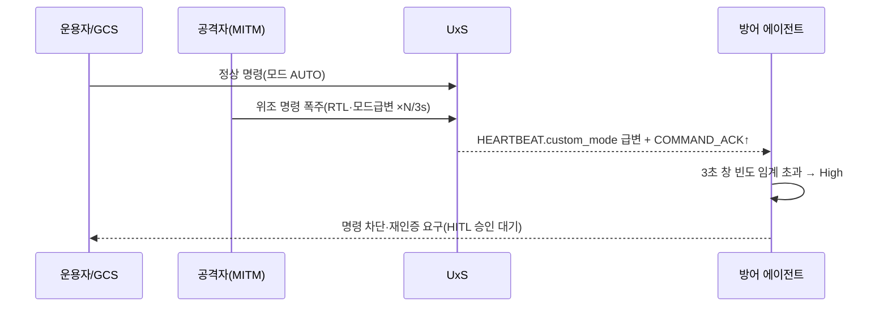
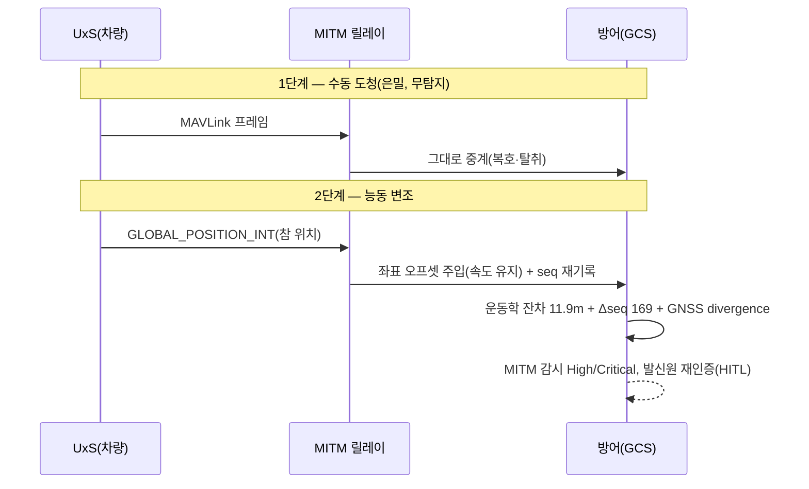
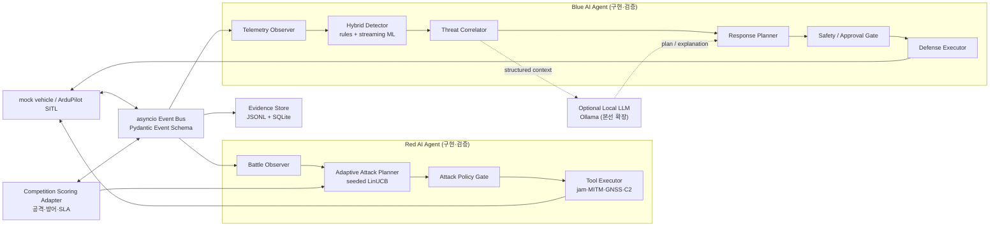
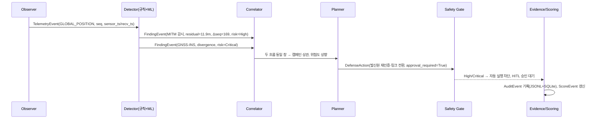

<!--
  DAH 2026 예선 보고서
  안내서 「4. 보고서 구성 요건」의 8개 항목 순서를 그대로 따른다.
-->

# DAH 2026 예선 보고서
## Defense AI Cyber Security Hackathon — UAV/UGV 자율 사이버 공방 에이전트

---

## 1. 표지

| 항목 | 내용 |
|------|------|
| 대회 | DAH 2026 (Defense AI Cyber Security Hackathon) 예선 |
| 보고서 제목 | UAV/UGV 공통 관측 기반 자율 사이버 공방 AI 에이전트 설계 및 구현 |
| 팀명 | **Cau멜레온** |
| 팀원 | **기태린 · 남진우 · 박희준 · 이상우** |
| 대표자 / 연락처 | **박희준 / qkrgmlwns0407@naver.com** |
| 제출일 | **2026. 07. [일]** |
| 부가자료 | GitHub 저장소 링크 · 소스코드 ZIP(외부 클라우드) — **[링크 기입]** |

> 본 보고서는 방산 무인체계(UAV·UGV)를 대상으로 한 공격 시나리오와 이를 탐지·차단·복구하는
> 방어 아키텍처, 그리고 이를 수행하는 AI 에이전트의 설계·구현 결과를 담는다. 모든 실험은
> 인터넷·GPU 없이 CPU 단일 환경에서 재현 가능한 격리 시뮬레이션(mock 차량 / ArduPilot SITL)에서
> 수행되었다.

---

## 2. 목차

1. 표지
2. 목차
3. 팀 구성 및 역할 분배·전문성
4. 방산 분야 공격 시나리오 설계
   - 4.1 대상 도메인과 데이터 흐름 모델
   - 4.2 공격자 능력 모델과 공격 표면 도출
   - 4.3 시나리오 A~G 상세 (전제조건·킬체인·관측 서명·탐지 난이도)
   - 4.4 공격 캠페인(연쇄 공격) 설계
   - 4.5 공격 영향도·우선순위 평가
5. 공격 시나리오 대응 방어 아키텍처 수립
   - 5.1 위협 모델링 체계 개요
   - 5.2 TARA — 자산·피해·공격경로·위험도 산정 (UAV / UGV)
   - 5.3 보조 위협모델 (STRIDE · STPA-Sec · MITRE ATLAS · IEC 62443)
   - 5.4 다층 방어(예방·탐지·대응·복구·개선)
   - 5.5 공격 → 관측 서명 → 탐지 알고리즘 → 대응 매핑
   - 5.6 위험 수준별 차등 처리와 실현 가능성
   - 5.7 위협 → 방어 요구사항 도출 (UAV / UGV)
6. AI 에이전트 설계 및 구현
   - 6.1 전체 논리 아키텍처
   - 6.2 공통 이벤트 계약
   - 6.3 방어(Blue) AI 에이전트 — 상세 설계·구현
   - 6.4 탐지·판단·대응 폐루프 워크스루
   - 6.5 기술 스택 결정
   - 6.6 실측 검증 결과
   - 6.7 실행·재현 방법
   - 6.8 공격(Red) AI 에이전트 — 설계·구현·검증
7. 결론 및 향후 계획
8. 참고문헌

---

## 3. 팀 구성 및 역할 분배·전문성

Cau멜레온은 방산 도메인 이해 → 위협 모델링 → 실행 가능한 방어·AI 구현이라는 하나의 파이프라인을
네 명이 **세 개의 협력 트랙**으로 나누어 병렬 수행하고, 공통 이벤트 계약과 채점 어댑터를 접점으로
통합한 팀이다. 역할이 특정 개인에 몰리지 않도록 각 트랙에 주담당·부담당을 교차 배치했다.

> **[전문 분야·관련 경험은 실제에 맞게 보완하십시오.]** 아래 담당 역할은 본 보고서와 저장소 산출물
> 기여를 기준으로 정리한 것이며, 안내서 ④(10점)의 "역할 분배·시너지" 기준에 맞춰 방산·보안·AI 경력
> 이나 수상 이력을 함께 기재하면 가점에 유리하다.

| 팀원 | 전문 분야 | 주담당 트랙 | 주요 산출물 | 관련 경험 |
|------|-----------|-------------|-------------|-----------|
| **박희준** (대표) | **[예: 사이버보안 / 위협모델링]** | 방어 전략 · 총괄 | 위협모델(TARA·STRIDE·STPA-Sec·ATLAS) 매핑, 방어 요구사항 도출, 보고서 총괄 | **[경력·수상]** |
| **기태린** | **[예: 무인체계 / 항공전자]** | 공격 설계 | 데이터 흐름·공격 표면 도출, 시나리오 A~G, Red 툴킷(`attacks/`) | **[경력·수상]** |
| **남진우** | **[예: 머신러닝 / 이상탐지]** | 엔지니어링(Blue) | Blue 에이전트, 규칙+스트리밍 ML 탐지, 상관기·플래너 | **[경력·수상]** |
| **이상우** | **[예: 시스템 / 인프라]** | 엔지니어링(플랫폼) | 이벤트 계약·감사·채점, mock/SITL 시뮬레이터, 재현 환경·테스트 | **[경력·수상]** |

**트랙별 역할 정의**

- **공격 설계 트랙(주: 기태린).** 방산 무인체계의 실제 운용 데이터 흐름을 공격 표면으로 분해하고,
  각 공격의 서사·전제조건·킬체인·관측 서명을 정의한다. `attacks/`의 C2 주입·GNSS 스푸핑·재밍·
  MITM·적대적 예제 도구를 구현·검증한다.
- **방어 전략 트랙(주: 박희준).** 공격 표면을 TARA를 골격으로 STRIDE·STPA-Sec·ATLAS·IEC 62443에
  매핑하고, 위험도 산정과 위험 수준별 처리 정책, 방어 요구사항을 도출한다. 공격 서명과 방어 로직의
  대응 관계가 끊기지 않도록 두 트랙의 접점을 관리한다.
- **엔지니어링 트랙(주: 남진우·이상우).** 방어 요구사항을 실행 가능한 탐지기·상관기·플래너·안전
  게이트로 구현하고(남진우), 이벤트 계약·증거 저장·채점·시뮬레이터·테스트로 재현 가능한 공방
  환경을 만든다(이상우).

**협업 방식.** 세 트랙은 6.2의 **공통 이벤트 계약**을 인터페이스로 병렬 개발했다. 공격 트랙이
정의한 "관측 서명"이 곧 방어 트랙의 탐지 요구사항이 되고, 이는 엔지니어링 트랙의 `FindingEvent`
스키마로 구체화된다. 모든 판단이 JSONL 증거로 남으므로 트랙 간 리뷰가 로그 기반으로 이루어지며,
채점 어댑터(`scoring/`)가 각 변경의 방어 점수·가용성 영향을 정량으로 되돌려준다 — 즉 팀 내부에서도
관측→판단→평가의 폐루프가 성립한다.

| 산출물(보고서 장) | 공격 설계 | 방어 전략 | 엔지니어링 |
|-------------------|:---:|:---:|:---:|
| 4장 공격 시나리오 | ●주 | ○부 | ○부 |
| 5장 방어 아키텍처 | ○부 | ●주 | ○부 |
| 6장 AI 에이전트 | ○부 | ○부 | ●주 |

---

## 4. 방산 분야 공격 시나리오 설계

### 4.1 대상 도메인과 데이터 흐름 모델

방산 무인체계(UxS: UAV/UGV)는 단순 IT 시스템이 아니라 **자율비행·자율주행·센서·제어·AI가
얽힌 사이버-물리 시스템(CPS)**이다. 침해의 결과가 데이터 유출에 그치지 않고 **추락·충돌·아군
피해·임무체계 장악** 같은 물리적 피해로 직결된다. 따라서 공격 표면 역시 IT 자산이 아니라 임무
수행에 필요한 **데이터 흐름** 위에서 정의해야 한다. 본 팀은 대표 운용 구조를 다음 데이터 흐름으로
모델링했다.

```
UxS(UAV/UGV) ── 데이터링크/전술망 ── GCS/UCS ── C5I/COP
    │  임무명령·경로·제어요청(하향)                         ▲
    │  텔레메트리(위치·속도·배터리·상태)(상향)               │ 상위 임무지시·상황정보 공유
    │  센서 데이터(영상·EO/IR·라이다·탐지)(상향)             │
    └  Health 데이터(고장·온도·통신품질)(상향) ──────────────┘
```

각 화살표(데이터 흐름)를 하나의 **공격 표면**으로 본다. 이 관점의 핵심 원리는 다음과 같다.

> **공격은 개별 데이터 흐름의 무결성·가용성·신뢰성을 노리지만, 그 결과는 반드시 GCS/UCS가
> 관측하는 공통 텔레메트리 서명으로 드러난다.** 방어는 특정 오토파일럿(PX4·ArduPilot 등)
> 내부 구현에 종속되지 않고 이 공통 서명만으로 탐지한다.

이 원리는 한국 방산 무인체계가 업체별 자체 개발 소프트웨어·폐쇄형 인터페이스를 쓰는 현실
(방어 전략 문서 「실현 가능성」)과 정합한다. 특정 공개 취약점에 의존하지 않으므로 제조사별
내부 구현이 공개되지 않아도 공통 확보 가능한 텔레메트리·네트워크 상태·센서 출력·AI 추론
결과·임무 맥락만으로 방어 판단을 수행할 수 있다.

**UAV와 UGV의 운용 차이(공격 표면에 반영).** 두 체계는 같은 MAVLink 기반 텔레메트리·명령
인터페이스를 공유하지만 위협의 무게중심이 다르다.

| 구분 | UAV(무인항공기) | UGV(무인지상차량) |
|------|-----------------|-------------------|
| 항법 핵심 | GNSS/INS 융합, 고도·속도 | GNSS + SLAM/지도, 조향·제동 |
| 치명 실패 | 추락·경로 이탈·귀환 불능 | 충돌·전복·임무구역 이탈·정지 실패 |
| 물리 접근성 | 낮음(비행 중) | **높음** — 정비 포트(USB/Debug/CAN)·OTA 노출 |
| AI 의존 | 표적식별·경로계획·군집협업(AI Mission Core) | 장애물 인식·경로계획·위험판단(AI Autonomy Core) |
| 특화 위협 | 재밍·GPS 스푸핑·도청·하이재킹 | + SLAM/지도 오염·공급망/정비·물리 탈취 |

이 차이 때문에 5장의 위협모델은 UAV(GNSS/INS·AI Mission Core 중심)와 UGV(SLAM/지도·구동부·
정비/물리접근 중심)를 분리해 산정한다.

### 4.2 공격자 능력 모델과 공격 표면 도출

공격 표면을 나열하기 전에 **공격자가 무엇을 할 수 있는가**를 능력 등급으로 전제해야 시나리오의
현실성이 확보된다. 본 팀은 다음 3등급을 가정한다.

| 등급 | 접근 능력 | 대표 공격 | 전제 |
|------|-----------|-----------|------|
| **원격/RF** | 스펙트럼 방사·수신, 링크 근접 | 재밍(E), GNSS 스푸핑(B), 도청(G-1단계) | 물리 침투 불필요, 탐지 회피 용이 |
| **네트워크 중간자** | 링크/게이트웨이 경로 장악 | MITM 변조(G-2단계), C2 주입(A), Health 위조(D) | 릴레이 하이재킹·경로/ARP 오염 |
| **공급망/내부** | 학습데이터·모델·펌웨어·정비포트 접근 | 모델/펌웨어 변조, 데이터 중독, SLAM 지도 오염 | 정비·업데이트·협력업체 경로 |

이를 4.1의 데이터 흐름에 겹쳐 공격 표면을 도출한다.

> 출처: 저장소 `docs/attack_scenarios.md` §0, `docs/architecture.md`. 각 공격은 저장소 내
> Red 코드로 재현·검증했다.

| # | 데이터 흐름 | 방향 | 공격 표면 | 공격자 등급 | 구현 모듈 | 대응 탐지기 | 상태 |
|---|-------------|------|-----------|-------------|-----------|-------------|------|
| A | 임무명령/경로/제어요청 | GCS → UxS | **C2 명령 주입** | 네트워크 중간자 | `attacks/c2_injection.py` | `CommandAnomalyMonitor` | 구현·검증 |
| B | 텔레메트리(위치·속도·배터리) | UxS → GCS | **GNSS 스푸핑** | 원격/RF | `attacks/gnss_spoof.py` | `GnssInsCrossCheck` | 구현·검증 |
| C | 센서 데이터(영상·EO/IR·라이다) | UxS → GCS | **AI 적대적 예제** | 근접/공급망 | `attacks/perception/adversarial_patch.py` | `SensorConsensusMonitor` | 구현(파이프라인 별도설치) |
| D | Health 데이터(고장·온도·통신품질) | UxS → GCS | 상태 위조(공격 은닉) | 네트워크 중간자 | (설계) | `StateConsistencyDetector` | 설계 |
| E | 데이터링크/전술망(전송계층) | 양방향 | **재밍 / DoS** | 원격/RF | `attacks/jamming_dos.py` | `LinkHealthMonitor` | 구현·검증 |
| F | 상위 임무지시/상황정보 공유 | C5I ↔ GCS | 상위체계 주입·오염 / 군집 신뢰 | 네트워크/내부 | (설계) | `SwarmConsensusDetector` | 설계 |
| G | 데이터링크/전술망(전송계층) | 양방향 | **MITM 인터셉션(도청→변조)** | 네트워크 중간자 | `attacks/mitm_intercept.py` | `InterceptionMonitor` | 구현·검증 |

또한 방어 전략 문서의 UAV/UGV 위협모델에서 도출한 두 추가 표면을 **설계 수준**으로 포함한다.

- **모델/펌웨어 변조** (AI/MLOps 공급망): 서명 없는 업데이트·해시 불일치 → ATLAS Poisoning / IEC 62443.
- **UGV SLAM/지도 오염**: 지도와 실시간 센서 관측 불일치 → STPA-Sec (지상 이동체 고유 위험).

### 4.3 시나리오 A~G 상세

각 시나리오는 **전제조건 → 공격 킬체인 → 관측 서명 → 탐지 난이도/회피 → 대응 플레이북**으로
기술한다. "관측 서명"이 방어와의 연결 고리이며, 5장에서 동일 서명을 탐지기로 받는다. 각 서명 옆의
STRIDE/ATT&CK 매핑은 5.3 위협모델과 직접 연결된다.

#### 시나리오 A — C2 명령 주입 (임무명령/제어요청 위조)

**전제조건.** 공격자가 명령 업링크(GCS → UxS) 경로에 개입(네트워크 중간자). MAVLink 등 다수 전술
데이터링크는 명령 무결성·발신자 인증이 약하다.

**공격 킬체인.**
```
1) 링크 관측 → 정상 명령 시퀀스·모드 학습
2) 위조 명령 주입: 강제 귀환(RTL) / 모드 급변 / 무장해제
3) 탐지 교란: 짧은 시간에 다수 모드 변경 명령을 폭주(replay flood)시켜
   정상 명령 사이에 위조 명령을 섞음
```

**관측 서명.** 주입 명령은 `HEARTBEAT.custom_mode` 급변과 `COMMAND_ACK` 빈도 증가로
텔레메트리에 나타난다. → "예상치 못한 모드 전환"(STRIDE-Tampering) + "비정상 명령 빈도".

**탐지 난이도/회피.** 단건 위조는 정상 명령과 구분이 어렵다(운용자도 모드를 바꿀 수 있음). 그래서
탐지는 **빈도·문맥**에 의존한다 — 3초 창 내 임계 초과, 임무 단계와 모순되는 전환. 공격자는 빈도를
임계 아래로 낮추면 회피 가능하나, 그러면 임무 교란 효과도 감소하는 트레이드오프가 있다.

**대응 플레이북.** 명령 서명검증/재인증 요구 → 위조 명령 차단 → 링크 전환. 모드 전환은
Medium(자동 조치), 명령 폭주는 High(운용자 승인).



#### 시나리오 B — GNSS 스푸핑 (텔레메트리 위치 위조)

**전제조건.** 원격/RF 공격자가 위성 신호보다 강한 위조 RF를 방사(실제)하거나 프로토콜 수준으로
외부 GPS를 주입(본 환경 모델). 융합 항법(EKF)이 원시 GPS를 신뢰하는 구간을 노린다.

**공격 킬체인.**
```
1) 대상 수신기의 정상 GPS 락 확인
2) 위조 좌표를 0m에서 시작해 서서히 램프업(0→150m) — 급변 탐지 회피
3) 원시 GPS(GPS_RAW_INT)는 위조 좌표로 끌려가지만,
   EKF/INS 융합 위치(GLOBAL_POSITION_INT)는 관성항법으로 잠시 참 경로 유지
```

**관측 서명.** 두 위치원의 **divergence 증가**가 스푸핑의 관측 가능한 서명이다. → GNSS-INS
교차검증이 임계값(경고 30m / 위험 100m) 초과로 탐지·에스컬레이션(STRIDE-Spoofing / STPA-Sec).

**탐지 난이도/회피.** 램프업은 "급변" 탐지를 회피하지만 divergence의 **누적**은 회피하지 못한다.
공격자가 INS까지 함께 속이려면 관성 센서에 물리적으로 개입해야 하므로 원격/RF만으로는 어렵다 —
이 비대칭이 GNSS-INS 교차검증의 근거다.

**대응 플레이북.** GNSS 신뢰도 하향 → INS/비전 기반 항법 전환 → 안전속도 제한 → (Critical)
즉시 귀환/정지 권고. 30~100m는 High(인간 승인), 100m 이상은 Critical.

#### 시나리오 C — AI 적대적 예제 (센서 데이터 인지 회피)

**전제조건.** 근접/공급망 공격자가 표적/장애물에 적대적 패치를 부착하거나 입력에 미세 섭동(PGD)을
가해 인지모델(YOLO 등)의 판단을 왜곡한다.

**공격 킬체인.**
```
1) 대상 인지모델의 클래스·결정경계 추정(질의 또는 사전지식)
2) 물리 패치(스티커) 또는 디지털 섭동 생성(PGD)
3) 표적 미탐지(회피) 또는 오분류 유도 → 임무 판단 오염
```

**관측 서명.** AI 탐지 신뢰도 급락 + 다중 센서 간 표적 판단 불일치. 이 신호는 텔레메트리만으로는
관측 불가하며 인지 계층에서 주입해야 한다(`SensorConsensusMonitor.inject_ai_result`) —
MITRE ATLAS Evasion.

**탐지 난이도/회피.** 단일 센서·단일 모델만 보면 "확신에 찬 오탐"을 구분하기 어렵다. 방어는
**다중 센서 합의**와 신뢰도 시계열 급락으로 우회한다. 공격자가 모든 센서를 동시에 속이려면 비용이
급증한다.

**대응 플레이북.** 센서 재검증 → 다중 센서 교차검증 → AI 신뢰도 하향 → 인간 확인 요청.

**상태.** 탐지기 로직은 구현·검증 가능하나 `torch`/`ultralytics` 의존성(용량 큼)이 필요해 이번
라이브 테스트에서는 이미지 파이프라인 실측을 제외했다.

#### 시나리오 D — Health 상태 위조 (공격 은닉) *(설계)*

**전제조건.** 네트워크 중간자가 상향 Health 데이터(배터리·온도·통신품질)를 변조.

**공격 킬체인.** 다른 공격의 물리적 흔적을 숨기거나(예: 스푸핑 중 정상 배터리로 위장) 거짓 고장을
주입해 임무 중단을 유도.

**관측 서명.** 상태 보고 불일치 — Health 급변, 명령↔상태 인과 불일치 → `StateConsistencyDetector`.

**대응 플레이북.** 상태 교차검증(복수 소스) → 상향 상태 신뢰도 하향 → 원인 확인 전 자율기능 제한.

#### 시나리오 E — 재밍 / DoS (데이터링크/전술망 저하)

**전제조건.** 원격/RF 공격자가 데이터링크 대역에 방해 신호를 방사. 본 도구는 텔레메트리 경로
중간의 UDP 릴레이로 동일 효과(패킷 드롭 80% + 지연 400±150ms)를 재현.

**공격 킬체인.**
```
1) 데이터링크 대역·프로토콜 식별
2) 광대역/표적 재밍 → 패킷 손실·지연·대역폭 저하
3) 지속 저하 → 제어 지연을 넘어 제어 상실 유도(가용성 공격)
```

**관측 서명.** HEARTBEAT 간격 급증 및 두절. → 링크 상태 감시가 간격 임계(정상×3) 초과는
Medium, 3초 이상 두절은 High로 탐지(STRIDE-DoS).

**탐지 난이도/회피.** 재밍 자체는 탐지가 쉽지만(링크가 죽으므로) **부작용**이 위험하다 — 4.4·5.4에서
보듯 패킷 손실이 GNSS-INS 교차검증의 오탐을 유발한다. 공격자는 이를 이용해 방어의 신뢰를 흔들 수
있다.

**대응 플레이북.** 자율 안전모드 유지 → 통신두절 안전정책(사전 정의 경로 복귀/정지) → 다중 링크 전환.

#### 시나리오 F — 상위체계 주입·오염 / 군집 신뢰 공격 *(설계)*

**전제조건.** 네트워크/내부 공격자가 손상된 한 대의 드론 또는 왜곡된 상위 상황정보(COP)를 통해
편대 판단을 오염.

**공격 킬체인.** 특정 노드만 반복적으로 위치·합의를 오염 → 전체 편대의 판단·임무 실패 유도
(방어 전략 문서 "협업 영역" 위험).

**관측 서명.** 특정 노드의 반복적 위치 이상, 군집 합의 결과 불일치 → `SwarmConsensusDetector`.

**대응 플레이북.** 이상 노드 격리·가중치 하향 → 합의 재수행 → 상위 상황정보 교차검증.

#### 시나리오 G — 데이터링크 MITM 인터셉션 (도청 → 능동 변조)

**전제조건.** 네트워크 중간자가 UxS↔GCS 경로에 삽입(무선 릴레이 하이재킹, 악성 게이트웨이,
경로/ARP 오염). 본 환경은 차량 텔레메트리 포트와 GCS(방어) 사이의 UDP 릴레이로 모델링.

**공격 킬체인(2단계).**
```
1단계 · 수동 도청: 모든 MAVLink 프레임을 바이트 단위로 그대로 중계하며 복호·파싱해
   위치·비행모드·배터리·무장상태·명령이력을 탈취. 프레임 미변경 → 내용상 서명 없음(은밀).
2단계 · 능동 변조: GLOBAL_POSITION_INT(운용자가 신뢰하는 융합 위치)의 좌표에 오프셋을
   주입하되 속도 필드(vx,vy)는 그대로 둠 → 상황인식 오염.
```

**관측 서명.** (1) 위치 변화량이 보고 속도와 어긋남(운동학 정합성 위반), (2) 재기록된 프레임이 새
MAVLink 시퀀스로 방출되어 동일 sysid의 seq가 역행·급점프(발신원 정합성 위반), (3) 위조된
융합위치 vs 참 원시 GPS 간 divergence. → `InterceptionMonitor`가 (1)(2)를, `GnssInsCrossCheck`가
(3)을 교차검증(STRIDE-Tampering/Spoofing, ATT&CK-ICS T0830).

**탐지 난이도/회피.** 1단계 도청은 **내용상 탐지 불가**(링크 인증·암호화·네트워크 계층의 몫). 2단계
변조는 속도 필드를 놔둔 순간 운동학이 깨지므로 잡힌다 — 공격자가 속도까지 정합하게 위조하려면
전체 운동 모델을 실시간으로 시뮬레이션해야 하고, seq 재기록 흔적까지 지우기는 어렵다.

**대응 플레이북.** 링크 무결성(서명/시퀀스) 검증 → 텔레메트리 발신원 재인증 → 융합위치 신뢰도
하향·원시GPS/INS 교차검증 → 링크 암호화·경로 무결성 점검 → 링크 전환. 운동학 잔차 6~25m는
High, 25m 이상은 Critical.



### 4.4 공격 캠페인(연쇄 공격) 설계

개별 공격보다 위협적인 것은 **여러 작은 변화의 누적으로 임무 결과를 편향시키는 연쇄 공격**이다.
본 팀이 상정한 대표 캠페인은 다음과 같다(기술 스택 문서 §1).

```
재밍으로 관측 품질 저하
  → MITM으로 텔레메트리 변조
    → GNSS 스푸핑으로 항법 교란
      → C2 명령 주입으로 임무 탈취 시도
```

| 단계 | 공격 | 노림수 | 예상 관측 서명 | 기대 위험도 |
|------|------|--------|----------------|-------------|
| 1 | 재밍(E) | 관측 품질 저하 + 무결성 탐지기 오탐 유발 | HEARTBEAT 간격↑, 패킷 손실↑, (부작용)GNSS divergence 오탐 | Medium~High |
| 2 | MITM(G) | 링크 장악·도청 후 텔레메트리 변조 | 운동학 잔차, seq 불연속 | High~Critical |
| 3 | GNSS 스푸핑(B) | 항법 교란(융합 위치 오염) | GPS↔INS divergence 램프업 | High→Critical |
| 4 | C2 주입(A) | 임무 탈취(모드/명령) | 모드 급변, 명령 빈도↑ | High |

이 캠페인의 설계 의도는 두 가지다. 첫째, **가용성 공격(재밍)이 무결성 탐지기의 오탐을 유발**하는
공격 표면 간 상호작용을 노린다(5.4의 실측 부작용 참조). 둘째, 각 단계가 단독으로는 임계값 미만이
되도록 강도를 낮추되, 시간 창 안에서 **여러 흐름이 함께 나타나면** 방어의 상관기가 이를 하나의
캠페인으로 묶어 위험도를 상향하도록 유도한다 — 즉 방어의 상관 능력을 직접 시험하는 설계다. 이는
Red AI 에이전트(6.8)가 Blue의 대응을 관측해 다음 단계 강도를 조절하는 적응형 공방의 기반이 된다.

### 4.5 공격 영향도·우선순위 평가

TARA의 영향도·공격가능성을 정성 등급으로 요약해 공격 우선순위를 매긴다(5.2에서 정량화). 방산
무인체계에서는 비용 효율보다 **작전 안전·아군 피해·기밀 유출**과 직결되는 위험을 우선한다.

| 공격 | 무결성 | 가용성 | 기밀성 | 물리적 영향 | 공격 용이성 | 종합 우선순위 |
|------|:---:|:---:|:---:|-------------|:---:|:---:|
| GNSS 스푸핑(B) | 상 | 중 | 하 | 추락·경로 이탈 | 중 | **최상** |
| MITM 인터셉션(G) | 상 | 하 | **상** | 상황인식 오염 | 중 | **최상** |
| C2 명령 주입(A) | 상 | 중 | 하 | 임무 탈취·무장해제 | 중 | 상 |
| 재밍/DoS(E) | 하 | **상** | 하 | 제어 상실 | 상 | 상 |
| 적대적 예제(C) | 상 | 하 | 하 | 표적 오인 | 중 | 중 |
| Health 위조(D) | 중 | 하 | 하 | 공격 은닉 | 중 | 중 |
| 군집/상위 오염(F) | 상 | 중 | 중 | 편대 임무 실패 | 하 | 중 |

---

## 5. 공격 시나리오 대응 방어 아키텍처 수립

### 5.1 위협 모델링 체계 개요

> 출처: 방어 전략 문서 `방어 전략 수립.pdf`. 본 팀은 UAV/UGV를 바로 위협 목록으로 분석하지
> 않고, **작전 대상·임무 환경·시스템 구조를 정의한 뒤 TARA로 위험을 평가**하고, 그 결과를 방어
> 요구사항과 방어 AI 에이전트로 연결하는 흐름을 취한다.

```
[작전 대상·임무 환경·시스템 구조] → [TARA: 자산·피해·공격경로·공격가능성·영향도]
   → 보조 위협모델(STRIDE·STPA-Sec·MITRE ATLAS·IEC 62443)로 정교화
   → [위험 우선순위] → [방어 요구사항] → [방어 AI 에이전트]
```

| 프레임워크 | 표준 | 본 프로젝트에서의 역할 |
|-----------|------|------------------------|
| **TARA** | ISO/SAE 21434 | 중심 골격. 자산·피해 시나리오·공격경로·공격가능성·영향도로 위험 우선순위 산정 |
| **STRIDE** | — | 구성요소별(센서·제어기·정비포트·GCS) 위협을 Spoofing/Tampering/…/EoP 6종으로 누락 없이 도출 |
| **STPA-Sec** | 안전공학 기반 | 잘못된 제어행동·안전모드 전환 실패·지연 대응 등 안전-보안 연결 문제 |
| **MITRE ATLAS** | AI 공격 | 적대적 예제·데이터 중독·모델 백도어·모델 추출 등 AI 고유 위협 |
| **IEC 62443 / NIST** | ICS/OT 보안 | 운용망·통제망·정비망·조직 차원의 위험관리(공급망·정비 포트) |

TARA만 쓰면 구성요소 간 상호작용에서 생기는 위험을 놓칠 수 있으므로, TARA를 골격으로 두고
나머지 모델을 보조로 결합해 정교화한다.

### 5.2 TARA — 자산·피해·공격경로·위험도 산정

위험도는 **영향도(1~5) × 공격가능성(1~5)** 을 5×5 매트릭스로 등급화한다(정성 → 등급). UAV와
UGV는 위협 무게중심이 다르므로 분리 산정한다.

**UAV 위협 산정**

| 자산 | 피해 시나리오 | 공격경로(공격표면) | 영향도 | 공격가능성 | 위험도 |
|------|---------------|--------------------|:---:|:---:|:---:|
| GNSS/INS 항법 | 위치 오염 → 경로 이탈·추락 | GNSS 스푸핑(B), MITM(G) | 5 | 3 | **Critical** |
| C2/텔레메트리 링크 | 명령 위조 → 임무 탈취·무장해제 | C2 주입(A) | 5 | 3 | **Critical** |
| 데이터링크 가용성 | 링크 저하 → 제어 상실 | 재밍/DoS(E) | 4 | 4 | **High** |
| AI Mission Core | 표적 오인 → 오조준·임무 실패 | 적대적 예제(C) | 4 | 2 | **High** |
| 상황인식(COP) | 융합 위치 오염 → 오판단 | MITM 변조(G) | 4 | 3 | **High** |
| 군집 합의 | 편대 판단 오염 → 임무 실패 | 상위/군집 오염(F) | 4 | 2 | **Medium~High** |
| AI/MLOps 공급망 | 모델·펌웨어 중독 → 지속 백도어 | 모델/펌웨어 변조 | 5 | 2 | **High** |

**UGV 위협 산정**

| 자산 | 피해 시나리오 | 공격경로(공격표면) | 영향도 | 공격가능성 | 위험도 |
|------|---------------|--------------------|:---:|:---:|:---:|
| SLAM/지도 | 지도 오염 → 충돌·경로 이탈 | SLAM/지도 오염 | 5 | 2 | **High** |
| 구동/제동(Drive-by-Wire) | 명령 위조 → 충돌·전복 | C2 주입(A) | 5 | 3 | **Critical** |
| GNSS + 위치/지도 | 위치 오염 → 임무구역 이탈 | GNSS 스푸핑(B) | 4 | 3 | **High** |
| 정비 포트(USB/CAN/Debug) | 물리 접근 → 펌웨어 변조·탈취 | 정비/공급망 | 5 | 2 | **High** |
| OCU/전술망 | 원격 탈취·명령 변조 | MITM(G), C2(A) | 5 | 3 | **Critical** |
| 센서 계층 | 블라인딩·오인식 → 정지 실패 | 적대적 예제(C) | 4 | 2 | **High** |

핵심 관찰: UAV는 **GNSS/INS·C2 링크**가, UGV는 **구동/제동·OCU·정비 포트**가 Critical 자산이다.
공통적으로 항법 오염(B·G)과 명령 위조(A)가 최상위 위험이며, 이는 4.5의 우선순위와 일치한다.

### 5.3 보조 위협모델

**STRIDE — 구성요소별 위협(발췌).**

| 구성요소 | Spoofing | Tampering | Repudiation | Info. Disclosure | DoS | EoP |
|----------|----------|-----------|-------------|------------------|-----|-----|
| C2/텔레메트리 링크 | 발신원 위조(A) | 명령/피드백 변조(A·G) | 명령 부인 | 도청(G) | 재밍(E) | 명령권 탈취 |
| GNSS/INS | 위성 신호 위조(B) | 융합 위치 변조(G) | — | — | 신호 차단 | — |
| 센서/AI Core | — | 입력 섭동(C) | — | 모델 추출 | 센서 블라인딩 | 오판단 유도 |
| 정비/OTA | 업데이트 위장 | 펌웨어 변조 | 업데이트 부인 | 키·모델 유출 | — | 권한 상승 |

**STPA-Sec — 불안전 제어행동(UCA) 예시.**

| 제어행동 | 불안전 조건 | 유발 공격 | 안전 제약(방어 요구) |
|----------|-------------|-----------|----------------------|
| 항법 위치 신뢰 | 위조 위치를 참으로 사용 | B·G | GNSS-INS 교차검증, 신뢰도 게이트 |
| 모드 전환 수용 | 위조 명령으로 전환 | A | 명령 서명검증·재인증, 빈도 제한 |
| 링크 두절 시 지속 | 안전정책 없이 자율 지속 | E | 통신두절 안전정책(경로 복귀/정지) |
| 표적 판단 실행 | 오인식 표적에 조치 | C | 다중 센서 합의, 인간 확인 |

**MITRE ATLAS — AI 고유 위협.**

| 기법 | 시나리오 | 방어 |
|------|----------|------|
| Evasion(적대적 예제) | C | 다중 센서 합의, 신뢰도 시계열 감시 |
| Data Poisoning | 모델 변조(공급망) | 데이터 출처 검증, shadow 승격 정책 |
| Model Backdoor | 펌웨어/모델 변조 | 서명 검증, 해시·버전 기록, 롤백 |
| Model Extraction | 반복 질의 | 질의 이상탐지(설계) |

**IEC 62443 — 존/도관(Zone/Conduit) 관점.** 운용망(GCS/OCU)·전술망(데이터링크)·탑재망(FC/센서/
AI)·정비망(USB/CAN/OTA)을 존으로 분리하고, 존 간 도관에 인증·무결성·접근통제를 요구한다. 특히
정비망은 UGV에서 물리 접근성이 높아 별도 통제(포트 접근통제·OTA 서명)를 요구한다.

### 5.4 다층 방어(예방·탐지·대응·복구·개선)

> 출처: 방어 전략 문서 「방어 아키텍처의 견고성 및 실현 가능성」.

단일 보안통제에 의존하지 않고 다계층으로 설계한다. 통신 암호화가 우회되더라도 명령 정책
검증·런타임 이상탐지로 피해를 제한하고, 센서 교란이 발생하더라도 다중 센서 교차검증·안전모드
전환으로 임무 실패 확산을 억제한다.

| 방어 계층 | 목적 | 적용 예시 | 관련 시나리오 |
|-----------|------|-----------|---------------|
| **예방** | 공격 성공 가능성 감소 | 인증·암호화·서명검증·접근통제·포트 통제 | 전(全) |
| **탐지** | 이상징후 조기 식별 | GNSS-INS 불일치, 명령 빈도 이상, 센서 신뢰도 급락, 링크 상태 | A·B·C·E·G |
| **대응** | 피해 확산 차단 | 명령 차단, 링크 전환, 안전모드, 귀환/정지 권고 | A·B·E·G |
| **복구** | 정상 상태 회복 | 모델/펌웨어 롤백, 임무 재계획, 안정 버전 복구 | 공급망·D |
| **개선** | 방어체계 고도화 | 사고 로그 기반 위협모델 KB 업데이트 | 전(全) |

**설계 원칙(저장소 `docs/architecture.md`와 일치):**
1. **특정 오토파일럿 비종속** — 공통 관측 데이터(텔레메트리/네트워크/센서/AI출력)만 사용.
2. **폐루프** — 탐지 → 위협모델 매핑 → 위험 재평가 → 플레이북 선택.
3. **Human-in-the-loop 게이트** — Medium 이하 자동, High↑는 운용자 승인.
4. **증거 보존** — 모든 인시던트를 구조화 JSON으로 저장 → 사후 분석·위협모델 KB 갱신.

**실측으로 발견한 공격 표면 간 상호작용(개선 후보).** 재밍 테스트(E) 구간에서 아무 위치 위조를
하지 않았는데도 GNSS-INS 교차검증이 39m·42m divergence를 High로 **오탐(2건)**했다. 원인은 80%
패킷 손실 하에서 `GPS_RAW_INT`와 `GLOBAL_POSITION_INT`가 서로 다른 시점에 도착·유실되어 방어가
시각 정렬 없이 최신 GPS를 오래된(stale) INS와 비교했기 때문이다. 기체가 원형 순찰을 12 m/s로 도는
동안 ~1.3초 간격이면 약 15m를 이동하므로, 실제 스푸핑이 없어도 겉보기 divergence가 발생한다. →
**개선안:** 교차검증 시 두 위치원의 타임스탬프 차를 확인해 stale 샘플이면 판정을 보류하고, 링크
저하가 동시 관측되면 GNSS 오탐 신뢰도를 하향. 이 개선은 이벤트 계약에 `sensor_ts`/`recv_ts` 분리로
반영했다(6.2).

### 5.5 공격 → 관측 서명 → 탐지 알고리즘 → 대응 매핑

> 출처: 저장소 `docs/architecture.md`, `defense/detectors.py`. 각 탐지기는 이상징후를 위협모델에
> 매핑하고 위험도·대응 플레이북을 함께 산출한다(코드: `Finding` 데이터클래스).

| 공격 | 관측 서명(공통 텔레메트리) | 탐지기 | 위협모델 | 대응 |
|------|---------------------------|--------|----------|------|
| GNSS 스푸핑 | `GPS_RAW` vs `GLOBAL_POSITION` divergence ↑ | `GnssInsCrossCheck` | STRIDE-Spoofing / STPA-Sec | 신뢰도 하향→INS 전환→(Critical)귀환 |
| C2 명령 주입 | `COMMAND_ACK` 빈도 ↑, 모드 급변 | `CommandAnomalyMonitor` | STRIDE-Tampering | 재인증·명령 차단·링크 전환 |
| 재밍/DoS | HEARTBEAT 간격 ↑, 두절 | `LinkHealthMonitor` | STRIDE-DoS | 통신두절 안전정책·경로 복귀 |
| 적대적 예제 | 탐지 신뢰도 급락, 센서 불일치 | `SensorConsensusMonitor` | ATLAS-Evasion | 센서 재검증·인간 확인 |
| MITM 인터셉션 | 운동학 잔차, seq 불연속, divergence | `InterceptionMonitor`+`GnssInsCrossCheck` | STRIDE-Tampering / ATT&CK-ICS T0830 | 무결성 검증·발신원 재인증·링크 전환 |

**탐지 알고리즘 상세(의사코드).** 각 탐지기는 공통 관측 신호만 입력받아 위험도와 근거를 산출한다.

*GNSS-INS 교차검증(`GnssInsCrossCheck`, warn=30m, crit=100m):*
```
on GPS_RAW_INT:      last_gps  = (lat, lon)
on GLOBAL_POSITION:  last_glob = (lat, lon)
if last_gps and last_glob:
    d = haversine_m(last_gps, last_glob)
    if d >= crit:  return Finding(risk=Critical, evidence={divergence: d})
    if d >= warn:  return Finding(risk=High,     evidence={divergence: d})
# 개선안: |sensor_ts_gps - sensor_ts_glob| 가 크면 stale → 판정 보류
```

*MITM 운동학 정합성(`InterceptionMonitor`):*
```
on GLOBAL_POSITION(pos, vx, vy, seq, sysid):
    expected_move = speed(vx,vy) * dt
    actual_move   = haversine_m(prev_pos, pos)
    residual      = |actual_move - expected_move|
    if residual >= 25:  risk = Critical
    elif residual >= 6: risk = High
    if seq_discontinuity(sysid, seq):   # 역행/급점프
        emit Finding(signal="시퀀스 불연속(Δseq)", risk=High)
```

*C2 명령 이상(`CommandAnomalyMonitor`, window=3s):*
```
on COMMAND / mode_change:
    push(ts) into sliding_window(3s)
    if count(window) > threshold: risk = High   # 명령 폭주
    if mode_change unexpected_for_mission_phase: risk >= Medium
```

*링크 상태(`LinkHealthMonitor`):*
```
track HEARTBEAT interval; nominal = baseline
if interval > 3 * nominal: risk = Medium
if no HEARTBEAT for > 3s:  risk = High   # 두절
```

임계값 근거(코드): `GnssInsCrossCheck(warn_m=30, crit_m=100)`, MITM 운동학 잔차 6~25m High /
25m↑ Critical. 임계값은 `configs/default.toml`로 분리해 본선 규격에 맞춰 교체 가능하다.

### 5.6 위험 수준별 차등 처리와 실현 가능성

모든 위험을 제거하는 것은 폐쇄형 구조·장기 운용주기·다수 협력업체 공급망·제한적 현장 패치
환경을 갖는 한국 방산 무인체계에서 비현실적이다. 따라서 위험 수준에 따라 차등 처리한다.

| 위험 수준 | 기본 선택 | 설명 |
|-----------|-----------|------|
| **Critical** | 회피 + 감소 | 추락·충돌·아군 피해·임무체계 장악 등 치명적 결과 예상 시 기능 중단·안전모드 전환 우선 |
| **High** | 감소 중심, 필요 시 회피 | GPS 스푸핑·C2 변조·악성 업데이트 등 임무 실패/제어권 상실 위험은 통제·탐지 강화로 낮춤 |
| **Medium** | 감소 + 조건부 수용 | 센서 신뢰도 저하·일시적 통신 저하 등 통제 가능 위험은 감시 강화·제한 운용으로 수용 |
| **Low** | 수용 | 영향 작고 발생 가능성 낮은 위험은 로그 수집·주기 점검 조건으로 수용 |
| **공급망/정비** | 감소 + 전가 | 계약상 보안 요구사항·패치 SLA·검증자료 제출로 일부 전가(작전·안전 책임은 전가하지 않음) |

**실현 가능성.** 방어 판단을 제조사 내부 구현이 아니라 공통 확보 가능한 신호(텔레메트리·네트워크
상태·센서 출력·AI 추론·임무 맥락·시스템 로그)에 두었으므로, 특정 오픈소스 오토파일럿·공개
취약점에 종속되지 않는다. AI 에이전트는 탐지·분석·권고·저위험 자동조치만 담당하고 치명적 제어는
정책 엔진과 인간 승인 절차에 둔다 — 자율주행·자율비행에서 AI가 치명적 제어권을 단독으로 갖는
것을 피하기 위함이다.

### 5.7 위협 → 방어 요구사항 도출

위협모델의 결론을 실제 구현 가능한 방어 요구사항으로 정리한다(UAV/UGV 공통 + 개별).

| 방어 요구사항 | 대응 위협 | UAV | UGV | 구현 위치 |
|---------------|-----------|:---:|:---:|-----------|
| 링크 인증·암호화 | A·G·도청 | ● | ● | 예방(링크 계층) |
| 명령 서명검증·재인증 | A | ● | ● | `CommandAnomalyMonitor`+정책 |
| GNSS-INS·비전 교차검증 | B·G | ● | ● | `GnssInsCrossCheck` |
| 링크 무결성(시퀀스/발신원) | G | ● | ● | `InterceptionMonitor` |
| 통신두절 안전정책 | E | ● | ● | `LinkHealthMonitor`+플레이북 |
| 다중 센서 합의 | C | ● | ● | `SensorConsensusMonitor` |
| 군집 노드 신뢰도 평가 | F | ● | ○ | `SwarmConsensusDetector` |
| SLAM/지도 무결성 검증 | 지도 오염 | ○ | ● | (설계) |
| OTA/모델 서명 검증·롤백 | 공급망 | ● | ● | (설계) |
| 정비 포트 접근통제 | 물리/정비 | ○ | ● | (운용 정책) |

이 요구사항들이 6장 방어 AI 에이전트의 탐지기·플레이북으로 구현되며, 미구현(설계) 항목은 7장
향후 계획에 로드맵으로 연결된다.

---

## 6. AI 에이전트 설계 및 구현

### 6.1 전체 논리 아키텍처

> 출처: 저장소 `docs/agent_technology_stack.md` §3, `docs/blue_agent.md` §3.



각 상자는 논리 에이전트/모듈이며 내부 객체를 직접 참조하지 않고 **공통 이벤트**만 교환한다.
예선 단계에서는 같은 프로세스의 `asyncio.Task`로 실행되며(네트워크 마이크로서비스 아님),
이벤트 계약 덕분에 본선에서 컨테이너 분리로 확장 가능하다.

**자율성 경계(핵심 안전 설계).** 에이전트는 치명적 제어를 직접 수행하지 않는다. Low·Medium
대응만 자동 실행하고, High·Critical은 `approval_required=True`로 표시해 사람 승인(HITL) 없이는
실행하지 않는다. 실행 대상은 loopback/mock/SITL로만 제한한다. LLM은 패킷·기체를 직접 제어하지
않고 허용된 도구·플레이북만 선택한다.

**안전 경로 / 지능 경로 분리.** 규칙 탐지기는 결정론적 즉시 차단 근거(안전 경로)로, ML/LLM 결과는
보조 점수로만 쓰고 위험도 상한을 둔다(지능 경로). 이 분리로 ML이 실패하거나 LLM이 없어도
공방·채점·로그가 중단되지 않는다.

### 6.2 공통 이벤트 계약

> 출처: 저장소 `core/events.py`(Pydantic 2 스키마), 기술 스택 문서 §6.

| 이벤트 | 핵심 필드 | 생산자 → 소비자 |
|--------|-----------|-----------------|
| `TelemetryEvent` | vehicle, source, **sensor_ts / recv_ts**, features | Observer → Detector |
| `FindingEvent` | detector, signal, **flow(A~F)**, confidence, risk, threat_map, evidence | Detector → Correlator |
| `AttackAction` | tool, parameters, rationale, policy_version | Red Planner → Gate/Executor |
| `DefenseAction` | playbook, steps, risk, **approval_required**, rationale, input_refs | Planner → Gate |
| `OutcomeEvent` | objective, success, latency, side_effects | Simulator → Evaluator |
| `ScoreEvent` | attack, defense, **availability(SLA 0~100)**, diagnostics | Scoring → Planner |
| `AuditEvent` | actor, decision, input_refs, model_version | 모든 모듈 → Evidence |

**주요 필드 의미.**

| 필드 | 설명 | 왜 필요한가 |
|------|------|-------------|
| `sensor_ts` / `recv_ts` | 발신 시간 / 수신 시간 분리 | stale 샘플 오탐 방지(5.4 부작용의 구조적 해결) |
| `flow` | 공격 흐름 A~F 라벨 | 상관기가 서로 다른 흐름을 캠페인으로 묶는 키 |
| `risk` | Low/Medium/High/Critical | 안전 게이트의 자동/HITL 분기 기준 |
| `approval_required` | High↑ 표시 | 무승인 실행 차단(자율성 경계) |
| `input_refs` | 판단 근거 이벤트 참조 | 설명 가능성·사후 재구성 |
| `episode_id`/`correlation_id`/`schema_version` | 전 이벤트 공통 | 재현·상관·스키마 진화 |

**필수 규칙 준수:** (1) 센서 시간과 수신 시간 분리로 stale 오탐 방지. (2) 모든 이벤트가 `episode_id`·
`correlation_id`·`schema_version`을 가진다. (3) 행동 이벤트는 선택 당시 정책/모델 버전과 입력 증거
참조를 남긴다. (4) 큐는 크기 제한과 backpressure 정책을 가진다(무한 버퍼 금지).

### 6.3 방어(Blue) AI 에이전트 — 상세 설계·구현

> 출처: 저장소 `agents/blue/*`, `core/*`, `scoring/*`. 관측→판단→행동→평가가 닫힌 루프.

**공격 흐름 A~F 커버리지.** 대표공격흐름의 여섯 축을 탐지기로 하나씩 대응시켰다.

| 흐름 | 흔드는 신뢰 | 탐지기(모듈) | 주요 관측 서명 |
|------|-------------|--------------|----------------|
| **A** 경로/상황인식 | 항법·경로·COP | `GnssInsCrossCheck`, `RouteConsistencyDetector` | GPS_RAW↔GLOBAL_POSITION 편차, 위치미분↔보고속도 불일치 |
| **B** C2/운용자 | 명령 정통성·승인 | `CommandAnomalyDetector` | COMMAND_ACK 빈도 급증, 예상 밖 모드 전환 |
| **C** 텔레메트리 보정 | 상향 상태 | `StateConsistencyDetector` | Health(배터리) 급변 등 상태 보고 불일치 |
| **D** 통신/자율모드 | 링크 가용성 | `LinkHealthDetector` | HEARTBEAT 두절/지연, drop_rate·RSSI 저하 |
| **E** 센서/AI | 센서·AI 판단 | `SensorConsensusDetector` | AI 신뢰도 급락, 센서 간 합의도 저하 |
| **F** 군집 | 노드 간 공유·합의 | `SwarmConsensusDetector` | 특정 노드만 반복 위치 이상, 합의 불일치 |

**핵심 모듈 상세.**

- **6.3.1 Telemetry Observer** (`observer.py`) — pymavlink로 MAVLink를 수집해 **프로토콜 비종속
  표준 features**로 정규화. `sensor_ts`(발신)·`recv_ts`(수신)를 분리해 신선도 기반 stale 오탐 억제.
  메시지가 없을 때도 `LINK_PROBE`를 주기 발행해 두절/재밍 탐지를 지속. bounded 버퍼로 최근 N개만
  유지.
- **6.3.2 규칙 탐지기(안전 경로)** (`rule_detectors.py`, `swarm.py`) — 알려진 고위험 징후를
  **결정론적·저지연**으로 즉시 포착. `TelemetryEvent`를 소비하고 위협모델 매핑·위험도·근거를 담은
  `FindingEvent`를 발행.
- **6.3.3 스트리밍 ML + 드리프트(지능 경로)** (`hybrid_detector.py`) — **River Half-Space Trees**로
  복합·미지 이상 패턴을 보조 점수화, **River ADWIN**으로 정상 분포 변화를 shadow로 감시. 규칙
  탐지기를 대체하지 않으며 confidence·risk를 **Medium 상한**으로 제한해 단독 차단 근거로 쓰지
  않는다. `river` 미설치 시 결정론적으로 비활성화되고 공방·채점은 계속 동작.
- **6.3.4 Threat Correlator** (`correlator.py`) — 차량별 슬라이딩 시간 창으로 여러 `FindingEvent`를
  **하나의 공격 캠페인**으로 결합. 서로 다른 흐름(A~F)이 짧은 창에서 함께 나타나면 위험도를 한
  단계 상향(4.4의 누적 편향 캠페인 대응).
- **6.3.5 Response Planner** (`response_planner.py`) — 대응 문구를 탐지기에 하드코딩하지 않고
  **흐름별 플레이북 테이블**로 분리. 위험도 + 캠페인 맥락으로 선택. 선택적 LLM은 근거 생성에만
  쓰고 실패 시 결정론 폴백. High↑는 `approval_required=True`로 게이트에 넘긴다.
- **6.3.6 Safety/Approval Gate** (`safety_gate.py`) — **allowlist**(알려진 안전 플레이북만 자동 실행
  후보) + **HITL**(High·Critical은 사람 승인 없이 실행 안 함) + **대상 제한**(loopback/mock/SITL).
- **6.3.7 Evidence Recorder** (`core/audit.py`) — 모든 이벤트를 append-only JSONL(사람이 읽고
  보고서에 인용) + episode 집계는 SQLite로 질의(findings/actions/scores 테이블).
- **6.3.8 채점** (`scoring/adapter.py`, `metrics.py`) — `CompetitionScoringAdapter`가 공식 축(공격·
  방어·가용성 SLA)을 계산하고 세부 배점은 `configs/scoring.toml`로 교체. 가용성(SLA)은 공격/방어와
  독립된 공통 제약으로 관리. 내부 지표(탐지 지연·오탐/미탐·자동/HITL 수)는 공식 점수를 대체하지
  않고 원인분석용.

**채점 로직(코드 근거, `scoring/adapter.py` + `configs/scoring.toml`).**
```
defense_points = Σ(TP·10  +  FP·(-4)  +  missed·(-8))         # 라벨 있을 때
               = findings·10                                   # 라벨 없는 데모(정탐 가정)
               + fast_detect_bonus(3)·|flows|  if 탐지지연 ≤ 2.0s
availability   = 100
               - link_loss_pct·0.5
               - (mission_deviation_m/100)·2.0
               - rejected_actions·1.5          # 과잉대응 감점
```
가용성을 공격/방어와 분리해 관리하는 이유는, 방어의 **과잉대응**(불필요한 링크 차단·HITL 남발)도
임무 가용성을 훼손할 수 있기 때문이다 — 방어가 무조건 강하게 대응하는 전략을 억제한다.

### 6.4 탐지·판단·대응 폐루프 워크스루

MITM 능동 변조 1건이 들어왔을 때 이벤트가 모듈을 통과하는 전체 경로를 예로 든다(실측 로그
`logs_mitm/incidents.jsonl` 기반).



이 한 사이클이 남기는 증거(실측 예):
```json
{ "detector": "MITM 인터셉션 감시",
  "signal": "위치 변화 15m가 보고 속도 기대치 3m와 12m 불일치 — 위치 위조 주입",
  "threat_map": {"STRIDE":"Tampering","STPA-Sec":"위조 피드백 기반 불안전 제어행동"},
  "risk": "High", "auto_action": false,
  "evidence": {"actual_move_m":14.9,"expected_move_m":3.0,"residual_m":11.9} }
```
모든 판단이 입력 증거·위협모델·위험도·게이트 결정과 함께 남으므로, 심사·운용자가 "왜 이렇게
판단했는가"를 로그만으로 재구성할 수 있다(설명 가능성).

### 6.5 기술 스택 결정

> 출처: 기술 스택 문서 §5. 대형 모델 의존성을 기본 데모에 강제하지 않도록 requirements를 분리.

| 영역 | 채택 기술 | 선택 이유 |
|------|-----------|-----------|
| 언어/런타임 | Python 3.11+ (`asyncio`·`tomllib`) | 기존 코드 재사용, 프레임워크 종속 최소화 |
| 차량 프로토콜 | MAVLink 2, `pymavlink==2.4.42` | UAV·UGV 공통 텔레메트리/명령 인터페이스 |
| 시뮬레이터 | `sim.mock_vehicle` / ArduPilot SITL | CPU 빠른 반복 + 실제 오토파일럿 검증 |
| 메시지 계약 | Pydantic 2 + JSON Schema | 경계 입력 검증, 로그/LLM 동일 스키마 |
| Blue 이상탐지 | River Half-Space Trees + ADWIN | CPU 친화적 스트리밍 추론·드리프트 감시 |
| Red 정책 | NumPy 기반 seeded LinUCB | 적은 데이터에서 실시간 적응, 설명 가능 |
| LLM 런타임 | Ollama 로컬 API (본선/선택) | 외부 API 없이 구조화 계획·설명 |
| 이벤트 원장 | append-only JSONL + SQLite | 사람이 읽는 증거 + 서버 없는 집계 |
| 설정 | TOML + Pydantic Settings | 본선 배점·임계값·포트 교체 가능 |
| 배포 | venv/pip, Docker Compose | 로컬 CPU 데모 + SITL 재현 |

의존성 분리: `requirements-core.txt`(pymavlink·pydantic·rich·numpy)만으로 완주, `-ml.txt`(river)·
`-perception.txt`(torch·ultralytics)·`-dev.txt`(pytest·ruff·mypy)는 선택.

**채택하지 않은 선택(과설계 회피).**

| 선택 | 제외 이유 |
|------|-----------|
| 범용 에이전트 프레임워크(LangGraph 등) | 실시간 경로에 불필요한 복잡성·디버깅 비용 |
| 외부 상용 LLM API 필수화 | 방산 오프라인성·재현성·데이터 통제와 충돌 |
| LLM의 직접 MAVLink 제어 | 비결정적 출력이 안전 경계를 우회할 위험 |
| 대규모 PPO 학습부터 시작 | 마감 전 환경·보상 설계·학습량 확보 어려움 |
| 운영 모델의 경기 중 즉시 재학습 | 데이터 포이즈닝·회귀 위험 |
| 초기 전면 마이크로서비스화 | 예선 구현 속도·로컬 디버깅에 불리 |

### 6.6 실측 검증 결과

> 출처: 저장소 `logs/incidents.jsonl`(50건), `logs_mitm/verify_summary.json`(30건),
> `logs_jam/incidents.jsonl`(12건), `docs/attack_scenarios.md` 라이브 테스트 표. 전용
> venv(`pymavlink==2.4.42`, `rich`)에서 `run_blue_demo.sh`(A+B) 및 별도 재밍·MITM 테스트 실행.

| 시나리오 | 탐지기 | 결과 | 위험도 | 게이트 |
|----------|--------|------|--------|--------|
| B. GNSS 스푸핑(UAV) | GNSS-INS 교차검증 | divergence 30→**150m** 램프업, 35건 | High 15 → **Critical 20** | 인간 승인 |
| A. C2 주입(UGV) | 명령 이상 감시 | 모드전환(3→6→5) + 3초 내 6~7건 폭주, 15건 | Medium 4 / High 11 | 자동/승인 혼합 |
| E. 재밍/DoS(UAV) | 링크 상태 감시 | 실측 손실률 **84%**, HEARTBEAT 간격 1.2~2.7s, 12건 | Medium 9 / High 1(+GNSS 오탐 2) | 자동 조치 |
| G. MITM 인터셉션(UAV) | MITM 감시 + GNSS-INS | 도청 6s(무탐지·은밀) → 변조 후 30건: 운동학 잔차 11.9m, seq 불연속 Δ169, divergence | High 18 / Critical 12 | 인간 승인 |

**MITM 검증 상세**(`verify_summary.json`): 릴레이 프레임 245개 중 40개 변조, 도청으로 sysid·모드
(AUTO)·무장(true)·배터리(92%)·홈좌표·궤적 16점 탈취. 능동 변조 개시 후 30건 탐지 —
`MITM 인터셉션 감시` 7건, `GNSS-INS 교차검증` 23건(교차검증 성립). 대표 근거: `residual_m=11.9`
(실제 이동 14.9m vs 기대 3m), `delta_seq=169`. 위협 매핑: STRIDE Tampering/Spoofing, ATT&CK-ICS
T0830(Adversary-in-the-Middle).

**전체 데모 집계:** 50건 인시던트, 위험도 High 26 / Critical 20 / Medium 4, 자동 조치 4건 /
인간 승인 46건. 모든 인시던트에 위협모델 매핑 + 대응 플레이북 + 증거 JSON 자동 기록. 복합 흐름
상관 시 위험도 Critical 자동 상향.

**검증 기준 충족(기술 스택 문서 §11).**

| 기준 | 충족 |
|------|:---:|
| 인터넷·외부 API·GPU 없이 한 명령 완주 | ● |
| 같은 시드·설정으로 행동 순서·점수 재현 | ● |
| 규칙 탐지와 ML 이상점수 병행 기록 | ● |
| High·Critical 무승인 실행 차단(HITL) | ● |
| 공격 도구는 loopback/mock/SITL 외 대상 거부 | ● |
| 공격·방어·가용성 점수 episode 단위 출력 | ● |
| LLM 없이도 공방·채점·로그 동작 | ● |
| 단위·통합 테스트 통과 | ● **30/30** |
| Red 적응형 정책 로그(baseline↔adaptive) | ● (6.8 실측) |

단위·통합 테스트 30/30 통과(기존 Blue 13 + Red 단위 13 + Red↔Blue 통합 4), 실행 중 에러/
트레이스백 없음. 테스트는 탐지기 판정·채점·정책 게이트·LinUCB 재현성·정책 게이트 안전경계·보상
비대칭·폐루프 통합을 회귀 검증한다(`tests/unit/`, `tests/integration/`).

### 6.7 실행·재현 방법

```bash
# 의존성 (코어만으로 완주 가능; ML은 선택)
pip install -r requirements-core.txt      # pymavlink, pydantic, rich, numpy
pip install -r requirements-ml.txt        # (선택) river — 미설치 시 자동 폴백

# 원커맨드 데모 ①: mock UAV+UGV + Blue Agent + 순차 공격 + 채점 요약
./run_blue_demo.sh

# 원커맨드 데모 ②: mock UAV + Blue + Red(적응형 LinUCB) 자율 공방 + baseline↔adaptive 비교
./run_redblue_demo.sh

# 수동 실행 — 자율 공방 캠페인(Blue+Red 공유 버스, 한 프로세스)
python -m sim.mock_vehicle --vehicle copter --port 14550           # 터미널 1 (UAV)
python -m agents.red.campaign --policy adaptive --decisions 16     # 터미널 2 (공방)
python -m agents.red.campaign --policy baseline --decisions 16     # 비교군

# 수동 실행 — Blue 단독 + 개별 공격 도구
python -m agents.blue.agent --uav udpin:127.0.0.1:14550
python -m attacks.gnss_spoof   --target udpout:127.0.0.1:14555 --drift-m 150

# MITM 검증 재현
python verify_mitm.py                      # 도청→변조→탐지 요약(logs_mitm/)

# 테스트
python -m pytest -q                        # 30 passed
```
> **포트 주의:** 텔레메트리 수신은 `port`(14550), 명령/스푸핑 주입은 cmd-in 포트 `port+5`(14555).
> 모든 공격 대상은 loopback/mock/SITL 엔드포인트로만 제한된다(안전/윤리 고지).

### 6.8 공격(Red) AI 에이전트 — 설계·구현·검증

> **구현 상태:** 구현·검증 완료. Blue 에이전트와 **대칭 구조**(Observer/Planner/Gate/Executor/
> Evaluator)로 `agents/red/`에 구현했고, 공통 이벤트 버스에서 Blue의 탐지·대응·점수를 관측해
> 다음 공격을 스스로 고르는 폐루프를 라이브(mock UAV)로 완주했다. 개별 공격 도구(`attacks/`)를
> allowlist 어댑터로 감싸 재사용한다.

**설계 개요**(기술 스택 문서 §4.1). Red Agent는 공격 스크립트를 순서대로 실행하는 데모가 아니라,
Blue의 탐지·차단 결과와 현재 점수를 관측해 다음 공격 종류·강도·대기시간을 스스로 바꾸는 폐루프
에이전트다. 관측→판단(LinUCB)→행동→평가가 Blue와 동일한 이벤트 계약 위에서 닫힌다.

| 구성 | 모듈 | 책임 | 판단 방식 |
|------|------|------|-----------|
| Battle Observer | `agents/red/observer.py` | Blue finding/action/score 구독 → 문맥·보상 창 집계 | 이벤트 집계 |
| Adaptive Attack Planner | `agents/red/planner.py` | 다음 공격·강도·대기 선택 | **seeded LinUCB** contextual bandit |
| Attack Policy Gate | `agents/red/policy_gate.py` | 대상·도구·파라미터·예산 검증 | allowlist + 클램프 + 상태 머신 |
| Tool Executor | `agents/red/executor.py` | 검증된 공격 도구 실행(라이브/서브프로세스) | `attacks/` 함수 어댑터 |
| Outcome Evaluator | `agents/red/agent.py` | 공격 성공/보상·공격점수 계산 | 관측 창 → 보상 |
| Campaign Runner | `agents/red/campaign.py` | Blue+Red 공유 버스 폐루프·통합 채점 | asyncio.Task |

**행동 공간(유한 도구 집합, `Arm`).** LinUCB가 고르는 이산 행동으로 프리셋했다.
```text
wait(1s)  ·  gnss_weak(45m)  ·  gnss_strong(150m)  ·  c2_weak(6)  ·  c2_strong(18)
(확장 정의: jam(loss,delay,dur) · mitm(drift,dur) — 링크 경로 필요 → 기본 게이트 차단)
```

**LinUCB(문맥적 밴딧).** 각 arm a마다 `A_a(d×d)`, `b_a(d)`를 유지하고
`p_a = θ_aᵀx + α·√(xᵀA_a⁻¹x)`로 신뢰상한이 최대인 arm을 고른 뒤, 관측 보상 r로
`A_a += xxᵀ, b_a += r·x` 갱신한다(NumPy, 시드 고정 → 재현). 문맥 벡터 x(d=6)는 **직전 창의
Blue 반응**(탐지 압박·HITL 유발·자동차단·가용성·유발 임팩트)으로 구성해 폐루프 피드백을 만든다.

**보상 설계(비대칭, 실측 검증됨).** 강하게 밀어붙이는 공격이 아니라 **탐지를 회피하며 임무를
편향**시키는 공격을 학습하도록: `+`임팩트(divergence) `+`HITL 유발 `+`은신 보너스(미탐) `−`저비용
자동차단. `wait`는 소액 기본가치(모두 차단당할 때 전략적 후퇴). 단위 테스트로 "은신 창 보상 >
자동차단 창 보상", "HITL 유발 > 단순 탐지"를 회귀 고정했다.

**안전 정책(자율성 경계, Blue와 동일 규칙).** 실행 대상은 loopback/mock/SITL만 허용(외부 대상
무조건 거부), 도구는 allowlist, 파라미터는 안전 상한으로 클램프(drift≤200m·count≤30·dur≤20s),
공격 예산 소진 시 `wait`로 강등. 정책 게이트를 단위 테스트로 검증했다.

**실측 검증(라이브 Red↔Blue, mock UAV, 각 5 의사결정).** 동일 공격 예산에서 adaptive(LinUCB)와
baseline(고정순서)을 비교했다. 공격 점수는 Red가 산출해 `CompetitionScoringAdapter`에 주입한다.

| 정책 | 공격 | 방어 | 가용성(SLA) | Red 은밀/탐지 | 행동 분포 | Blue 흐름 |
|------|:---:|:---:|:---:|:---:|-----------|-----------|
| **adaptive(LinUCB)** | **438.8** | 1450.0 | 97.0 | 0 / 5 | gnss_weak×2, gnss_strong×1, c2_strong×1, wait×1 | A·B·D |
| baseline(고정순서) | 367.9 | 1220.0 | 96.9 | 1 / 5 | 각 arm ×1 (라운드로빈) | A·B·D |

**adaptive 정책의 의사결정 로그(설명 가능성, `logs_red/adaptive_summary.json`):**

| # | 선택 arm | 탐지 | HITL 유발 | 임팩트 | 보상 | 공격점수Δ |
|---|----------|:---:|:---:|:---:|:---:|:---:|
| 1 | gnss_weak | ✔ | 28 | 47.0m | 0.394 | +85.9 |
| 2 | **gnss_weak(반복 학습)** | ✔ | 38 | 47.9m | 0.396 | +115.9 |
| 3 | wait | — | 1 | 0m | 0.150 | +3.0 |
| 4 | c2_strong | ✔ | 18 | 0m | 0.300 | +54.0 |
| 5 | **gnss_strong** | ✔ | 58 | **151.3m** | **0.600** | +180.0 |

**관찰.** (1) LinUCB는 고보상 GNSS 계열 arm을 **문맥에 따라 반복 선택**(baseline의 라운드로빈과
대비)해 동일 예산에서 공격 점수를 **+19%**(367.9→438.8) 끌어올렸다 — 고정 순서가 아니라 관측
문맥으로 공격을 바꾼 사례가 로그에 남는다(기술 스택 문서 §11 충족). (2) 모든 공격이 Blue에 탐지
되고 High·Critical로 에스컬레이션되어 **HITL 승인 대기로 보류(자동 실행 0)** — 양측 모두 자율성
경계를 준수했다. (3) Blue의 상관기가 흐름 A+B+D를 하나의 캠페인으로 묶어 Critical로 상향했다.
(4) 링크 저하 구간에서 경로 정합성·GNSS 교차검증이 stale 샘플로 함께 반응하는 5.4의 공격 표면
상호작용도 라이브에서 재현됐다.

**남은 확장(7장 로드맵).** 다중 차량(UGV 동시)·jam/mitm arm 라이브 활성화(링크 경로 토폴로지)·
LinUCB 하이퍼파라미터 튜닝·더 긴 에피소드에서의 수렴 곡선.

---

## 7. 결론 및 향후 계획

**결론.** Cau멜레온은 방산 무인체계(UAV/UGV)의 운용 데이터 흐름을 공격 표면으로 분해하고(A~G),
각 공격의 **공통 텔레메트리 관측 서명**을 도출한 뒤, 이를 TARA를 골격으로 한 위협모델
(STRIDE·STPA-Sec·MITRE ATLAS·IEC 62443)에 매핑하고 다시 **방어 요구사항·방어 AI 에이전트**로
연결하는 일관된 파이프라인을 설계했다. 핵심 기여는 특정 오토파일럿·공개 취약점에 종속되지 않는
**공통 관측 기반 방어**로, 폐쇄형 한국 방산 소프트웨어 환경에서도 실현 가능하다는 점이다.

방어(Blue) AI 에이전트는 관측→탐지(규칙+스트리밍 ML)→상관→대응→안전 게이트→증거→채점의
폐루프로 구현했고, mock UAV/UGV에서 4종 공격(GNSS·C2·재밍·MITM)에 대해 **총 50+건 인시던트를
위협모델 매핑·위험도·플레이북·증거와 함께 자동 기록**했다. 나아가 공격(Red) AI 에이전트를 Blue와
**대칭 구조**로 구현해, 공유 이벤트 버스에서 Blue의 반응을 관측하고 seeded LinUCB로 다음 공격을
스스로 고르는 **자율 공방 폐루프**를 라이브로 완주했다 — 동일 예산에서 adaptive가 baseline 대비
공격 점수 **+19%**(367.9→438.8)를 달성해 적응성을 실증했다. 전체 단위/통합 테스트 **30/30**을
통과했다. 특히 (1) High·Critical 대응을 무승인 실행하지 않는 HITL 자율성 경계(공방 양측 준수),
(2) 방어 과잉대응을 감점하는 가용성 채점, (3) 재밍이 GNSS 탐지기 오탐을 유발하는 공격 표면 간
상호작용을 실측으로 드러내고 구조적 개선안(타임스탬프 정렬)까지 제시한 점이 차별적 강점이다.

**향후 계획(단계별).**

| 단계 | 항목 | 내용 |
|------|------|------|
| 1 | **공격(Red) AI 확장** | (완료: seeded LinUCB 적응형 공격기·Red↔Blue 폐루프·baseline↔adaptive 비교, 6.8) → 다중 차량(UGV 동시)·jam/mitm arm 라이브 활성화·긴 에피소드 수렴 곡선 |
| 2 | **탐지 정교화** | stale 샘플 타임스탬프 정렬로 GNSS 오탐 억제, 흐름 C/E(상태·센서/AI) 교차검증 강화, perception 파이프라인 실측 |
| 3 | **선택적 Local LLM** | Ollama로 다중 Finding을 위협 가설·공격 단계로 요약, 한국어 상황 설명(Pydantic JSON Schema 검증 + 실패 시 결정론 폴백) |
| 4 | **모델 안전 운영** | shadow 모델 승격 정책(replay suite·오탐 상한·SLA 회귀 통과 시만 승격, 버전·해시·데이터 범위 기록·즉시 롤백) |
| 5 | **UGV 특화 방어** | SLAM/지도 무결성 검증, OTA/모델 서명 검증, 정비 포트 접근통제 구현 |
| 6 | **본선 확장** | 논리 에이전트 컨테이너 분리 + 주최 측 클라우드·시뮬레이터 인터페이스 adapter(전송 계층만 교체), 재생 대시보드·서명된 정책 번들 |

이 계획은 5.7에서 도출한 방어 요구사항 중 미구현(설계) 항목 — SLAM/지도 무결성, OTA/모델 서명,
정비 포트 통제, 군집 신뢰 — 을 우선순위대로 실체화하는 로드맵과 정합한다.

---

## 8. 참고문헌

**표준·프레임워크**
- ISO/SAE 21434, *Road vehicles — Cybersecurity engineering* (TARA).
- Microsoft, *STRIDE Threat Modeling*.
- W. Young, N. Leveson, *Systems-Theoretic Process Analysis for Security (STPA-Sec)*, MIT.
- MITRE, *ATLAS (Adversarial Threat Landscape for AI Systems)*, https://atlas.mitre.org
- MITRE, *ATT&CK for ICS* — T0830 Adversary-in-the-Middle.
- IEC 62443, *Industrial communication networks — IT security for networks and systems*; NIST SP 800-82.
- 한국기술학회, 「군용 드론/UAV에 대한 AI 적용과 사이버보안 취약요소에 관한 동향 연구」, 2026.

**기술 문서·도구**
- ArduPilot, *Using SITL for ArduPilot testing*, https://ardupilot.org/dev/docs/using-sitl-for-ardupilot-testing.html
- ArduPilot, *MAVLink Basics*, https://ardupilot.org/dev/docs/mavlink-basics.html
- Pydantic, *Models & Validation*, https://pydantic.dev/docs
- River, *Half-Space Trees*, https://riverml.xyz/latest/api/anomaly/HalfSpaceTrees/
- River, *ADWIN*, https://riverml.xyz/latest/api/drift/ADWIN/
- Ollama, *OpenAI-compatible API*, https://docs.ollama.com/api/openai-compatibility
---

<!--
  체크리스트(안내서 대비):
  ✔ 8개 항목 순서 준수 (문서 완성도 10점)
  ✔ 표·그림·코드 출처 표기 (문서 완성도)
  ✔ 4장 공격 시나리오 A~G + 공격자 능력모델 + 캠페인 + 영향도 (30점)
  ✔ 5장 TARA(UAV/UGV) + STRIDE/STPA-Sec/ATLAS/IEC62443 + 다층방어 + 방어요구사항 (25점)
  ✔ 6장 Blue 에이전트 상세 + 폐루프 워크스루 + 채점로직 + Red 구현·검증(6.8, baseline↔adaptive) (25점)
  ✔ 6.8 Red 적응형 공격 에이전트 구현·라이브 검증 완료 (30/30 테스트)
  ✔ 3장 팀 정보(Cau멜레온/4인) — 전문분야·경력은 보완 필요 (10점)
  ☐ 부가자료: GitHub/ZIP 링크, 데모 영상(선택)
  ☐ 팀원별 전문분야·관련경험·수상 보완
-->
