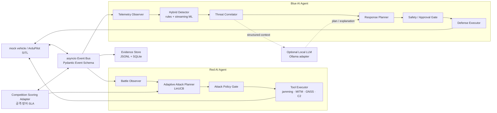

# DAH 2026 자율 공방 에이전트 개발 기술 스택

> 문서 상태: 설계 기준안 v0.1  
> 작성일: 2026-07-07  
> 범위: 예선 보고서의 「AI 에이전트 설계 및 구현」과 본선 확장 방향  
> 구현 상태 표기: **현재 구현** / **예선 제출 전** / **본선 확장**

## 1. 무엇을 만드는가

본 프로젝트는 UAV·UGV 모사 환경에서 **AI 공격 에이전트와 AI 방어 에이전트가
상대의 행동과 결과를 관찰하며 다음 행동을 스스로 선택하는 자율 공방 시스템**을 만든다.
공격 스크립트를 순서대로 실행하는 데모가 아니라, 관측·판단·행동·평가가 닫힌 루프를
이루는 것이 핵심이다.

대표 공방 캠페인은 다음과 같다.

```text
재밍으로 관측 품질 저하
  → MITM으로 텔레메트리 변조
    → GNSS 스푸핑으로 항법 교란
      → C2 명령 주입으로 임무 탈취 시도
```

Red Agent는 Blue Agent의 탐지·차단 결과와 현재 점수를 보고 공격 종류와 강도를
바꾼다. Blue Agent는 텔레메트리와 네트워크 상태를 융합해 위협을 탐지하고, 안전 정책
안에서 대응한다.

### 자율성 경계

- 격리된 mock/SITL 환경: Red·Blue 모두 완전 자율 실행
- 실제 운용 가정: Low·Medium 대응만 자동 실행
- High·Critical 대응: human-in-the-loop 승인 없이는 제어 명령을 실행하지 않음
- LLM: 패킷이나 기체를 직접 제어하지 않고 허용된 도구와 플레이북만 선택

## 2. 설계 원칙

1. **오프라인 우선**: 외부 API와 인터넷 없이 CPU 환경에서 기본 공방을 완주한다.
2. **안전 경로와 지능 경로 분리**: 실시간 안전 탐지는 결정론적으로 유지하고, ML·LLM
   결과는 신뢰도와 정책 게이트를 통과시킨다.
3. **설명 가능성**: 모든 판단은 입력 증거, 정책/모델 버전, 선택 행동, 점수 변화를 남긴다.
4. **재현성**: 난수 시드, 시나리오 설정, 모델 아티팩트와 이벤트 로그로 경기를 재생한다.
5. **단일 프로세스에서 시작**: 예선 프로토타입은 한 Python 프로세스에서 실행하되,
   메시지 계약을 통해 본선에서 에이전트별 컨테이너로 분리할 수 있게 한다.
6. **점수 규칙 격리**: 공개 전인 본선 세부 배점을 코드에 박지 않고 설정 가능한
   `CompetitionScoringAdapter`로 캡슐화한다.

## 3. 논리 아키텍처



그림의 각 상자는 논리 에이전트 또는 모듈이다. **예선 제출 전**에는 같은 프로세스의
`asyncio.Task`로 실행하며, 네트워크 마이크로서비스를 의미하지 않는다.

## 4. 에이전트 구성

### 4.1 Red AI Agent

| 구성 | 책임 | 판단 방식 |
|---|---|---|
| Battle Observer | Blue 탐지 여부, 차단 결과, SLA, 현재 공격 점수 관측 | 이벤트 집계 |
| Adaptive Attack Planner | 다음 공격·강도·대기시간 선택 | seeded LinUCB contextual bandit |
| Attack Policy Gate | 허용 대상·포트·시간·강도 검증 | allowlist + 상태 머신 |
| Tool Executor | 검증된 공격 도구 실행 | Python 함수/서브프로세스 어댑터 |
| Outcome Evaluator | 공격 성공 여부와 보상 계산 | Scoring Adapter |

Red Agent의 관측 문맥에는 링크 품질, 최근 탐지기 종류, Blue 대응, 임무 상태, 공격별
최근 성공률을 넣는다. 행동 공간은 자유 텍스트가 아니라 아래와 같은 유한 도구 집합이다.

```text
jam(drop_rate, latency_ms, duration_s)
mitm(mode, mutation_strength, duration_s)
gnss_spoof(drift_m, ramp_s, hold_s)
c2_inject(command, rate, count)
wait(duration_s)
```

LinUCB를 우선 선택하는 이유는 소량의 경기 데이터에서도 문맥별 행동을 온라인으로
고를 수 있고, 선택 근거와 보상을 기록하기 쉬우며, 대규모 강화학습 환경 구축이
필요하지 않기 때문이다. 구현은 NumPy만 사용하고 난수 시드를 고정한다.

### 4.2 Blue AI Agent

| 구성 | 책임 | 판단 방식 |
|---|---|---|
| Telemetry Observer | MAVLink·링크·임무 상태 수집과 시각 정렬 | pymavlink + bounded buffer |
| Rule Detector | 알려진 고위험 징후의 빠른 탐지 | 기존 GNSS/C2/DoS/MITM 탐지기 |
| Streaming ML Detector | 복합·미지 이상 패턴 점수화 | River Half-Space Trees |
| Drift Monitor | 정상 분포 변화 감시 | River ADWIN, shadow update |
| Threat Correlator | 여러 징후를 하나의 공격 캠페인으로 결합 | 시간 창 + 공격 그래프 |
| Response Planner | 대응 플레이북 선택·우선순위화 | 위험 점수 + 상태 머신 + 선택적 LLM |
| Safety/Approval Gate | 자동 실행 가능 여부 결정 | risk allowlist + HITL |
| Evidence Recorder | 입력·판단·행동·점수·모델 버전 보존 | JSONL + SQLite |

Half-Space Trees는 규칙 탐지기를 대체하지 않는다. 알려진 치명적 징후는 규칙으로 즉시
잡고, 스트리밍 모델은 여러 특성의 복합 이상을 보조 점수로 제공한다. 특히 모델이
윈도우 단위로 뭉친 이상에 약할 수 있으므로 단독 차단 근거로 사용하지 않는다.

### 4.3 선택적 Local LLM

로컬 LLM은 다음 작업에만 사용한다.

- 여러 Finding을 위협 가설과 공격 단계로 요약
- 허용된 대응 플레이북 중 후보와 근거 생성
- 심사·운용자용 한국어 상황 설명 생성

출력은 Pydantic JSON Schema로 검증하며, 타임아웃·파싱 실패·모델 미설치 시 결정론적
플래너로 즉시 폴백한다. 따라서 LLM 없이도 공방·채점·로그가 모두 동작해야 한다.

## 5. 기술 스택 결정표

| 영역 | 채택 기술 | 단계 | 선택 이유 |
|---|---|---|---|
| 언어/런타임 | Python 3.11+ | 현재/유지 | 기존 코드 재사용, `asyncio`·`tomllib` 사용 |
| 차량 프로토콜 | MAVLink 2, `pymavlink==2.4.42` | 현재 구현 | UAV·UGV 공통 텔레메트리/명령 인터페이스 |
| 경량 시뮬레이터 | `sim.mock_vehicle` | 현재 구현 | CPU에서 빠른 반복·결정적 재현 |
| 고충실도 시뮬레이터 | ArduPilot SITL Copter/Rover | 현재 구현, 검증 강화 | 실제 오토파일럿 동작과 고장 주입 검증 |
| 오케스트레이션 | `asyncio.Task`, `asyncio.Queue` | 예선 제출 전 | 낮은 지연, 프레임워크 종속성 최소화 |
| 메시지 계약 | Pydantic 2 + JSON Schema | 예선 제출 전 | 경계 입력 검증, 로그/LLM 출력의 동일 스키마 사용 |
| Red 정책 | NumPy 기반 seeded LinUCB | 예선 제출 전 | 적은 데이터에서 실시간 적응, 설명 가능한 선택 |
| Blue 안전 탐지 | 기존 Python 규칙 탐지기 | 현재 구현 | 알려진 위협에 결정적·저지연 대응 |
| Blue 이상탐지 | River Half-Space Trees + scaler | 예선 제출 전 | CPU 친화적 스트리밍 추론 |
| 분포 변화 감시 | River ADWIN | 예선 제출 전 | 경기 중 드리프트를 shadow 상태로 감시 |
| LLM 런타임 | Ollama 로컬 API | 본선 확장/선택 | 외부 API 없이 구조화된 계획·설명 생성 |
| 이벤트 원장 | append-only JSONL | 현재 구현 | 사람이 읽고 보고서 증거로 인용하기 쉬움 |
| 질의/집계 저장소 | SQLite | 예선 제출 전 | 서버 없이 점수·에피소드·지표 집계 |
| 설정 | TOML + Pydantic Settings 모델 | 예선 제출 전 | 본선 배점·임계값·포트 교체 가능 |
| CLI/터미널 UI | `argparse`, Rich | 현재 구현 | 오프라인 데모와 화면 녹화에 충분 |
| 테스트 | pytest + pytest-asyncio | 예선 제출 전 | 상태 머신·비동기 공방의 회귀 검증 |
| 품질 검사 | Ruff + mypy | 본선 확장 | 에이전트 계약과 비동기 코드 오류 감소 |
| 배포 | venv/pip, Docker Compose | 현재 구현 | 로컬 CPU 데모와 SITL 재현 환경 제공 |
| 본선 분산화 | 컨테이너별 agent + 외부 broker adapter | 본선 확장 | 본선 클라우드 규격 공개 후 전송 계층만 교체 |

### 의존성 분리 원칙

기본 데모에 대형 모델 의존성을 강제하지 않는다.

```text
requirements-core.txt        pymavlink, numpy, pydantic, rich
requirements-ml.txt          river
requirements-perception.txt  torch, torchvision, ultralytics, opencv
requirements-dev.txt         pytest, pytest-asyncio, ruff, mypy
```

실제 버전은 호환성 테스트 후 lock 파일에 고정한다. 문서나 Dockerfile에서 `latest` 태그를
사용하지 않고, 경기 로그에 Python·패키지·모델 버전을 함께 기록한다.

## 6. 공통 이벤트 계약

모든 에이전트는 내부 객체를 직접 참조하지 않고 아래 이벤트를 교환한다.

| 이벤트 | 핵심 필드 | 생산자 → 소비자 |
|---|---|---|
| `TelemetryEvent` | vehicle, source, timestamp, features, freshness | Observer → Detector |
| `FindingEvent` | detector, signal, confidence, evidence, threat_map | Detector → Correlator |
| `AttackAction` | tool, parameters, rationale, policy_version | Red Planner → Gate/Executor |
| `DefenseAction` | playbook, risk, approval_required, rationale | Blue Planner → Gate/Executor |
| `OutcomeEvent` | objective, success, latency, side_effects | Simulator → Evaluator |
| `ScoreEvent` | attack, defense, availability, diagnostics | Scoring Adapter → 양측 Planner |
| `AuditEvent` | actor, input_refs, decision, model_version | 모든 모듈 → Evidence Store |

필수 규칙은 다음과 같다.

- 센서 시간과 수신 시간을 분리해 stale sample 오탐을 방지한다.
- 각 이벤트는 `episode_id`, `correlation_id`, `schema_version`을 가진다.
- 행동 이벤트에는 선택 당시 정책/모델 버전과 입력 증거 참조를 남긴다.
- 큐는 무한 버퍼가 아니라 크기 제한과 backpressure 정책을 가진다.

## 7. 공식 채점과 내부 평가

공식 홈페이지에 공개된 본선 평가 축은 **공격 점수, 방어 점수, 가용성(SLA 0~100)**이다.
정확한 세부 배점은 아직 코드에 고정하지 않는다.

```python
CompetitionScore(
    attack_points=...,
    defense_points=...,
    availability=...,  # 0..100
)
```

`CompetitionScoringAdapter`는 공식 규칙이 공개되면 설정만 교체한다. 아래 내부 지표는
공식 점수를 대체하지 않고 원인 분석과 정책 학습에 사용한다.

- 탐지 지연과 대응 지연
- 공격별 성공률·차단률
- 오탐률·미탐률
- 임무 경로 이탈 거리와 임무 완료율
- 링크 가용성·패킷 손실·지연
- 자동 대응 수와 인간 승인 수
- 공격자의 미탐 지속시간

이 공방은 완전한 제로섬으로 가정하지 않는다. 공격/방어 점수 외에 양측 행동이 SLA를
훼손할 수 있으므로, 가용성을 독립된 공통 제약으로 관리한다.

## 8. 학습·모델 안전 정책

### Red Agent

- 경기 중 관측과 보상으로 공격 선택 정책을 즉시 갱신할 수 있다.
- 실행 가능한 행동은 allowlist 도구와 안전 범위 파라미터로 제한한다.
- 대상은 loopback, mock 또는 SITL 엔드포인트만 허용한다.

### Blue Agent

- 실시간 모델은 추론만 수행한다.
- 새 데이터 학습은 별도 shadow 모델에서 수행한다.
- shadow 모델은 정상·공격 replay suite, 오탐 상한, SLA 회귀 검사를 통과해야 승격한다.
- 승격된 모델은 버전·해시·학습 데이터 범위를 기록하며 즉시 롤백할 수 있어야 한다.

이 비대칭 정책은 Red의 적응성은 살리면서, Blue가 공격자가 주입한 데이터로 경기 중
오염되는 것을 방지한다.

## 9. 구현 상태와 로드맵

### 현재 구현

- mock UAV/UGV와 ArduPilot SITL Docker 구성
- MAVLink 기반 GNSS 스푸핑, C2 주입, 재밍/DoS, perception 공격 도구
- GNSS-INS, 링크 상태, 명령 이상, 센서 합의 탐지기
- MITM 공격·탐지 코드: 작업 트리에 존재하며 통합 검증 필요
- 위협모델 매핑, 위험도, 대응 플레이북, JSONL 증거 로그
- Rich 기반 터미널 데모

현재의 `DefenseAgent`는 규칙 탐지기를 순회하는 단일 방어 루프다. 아직 Red의 적응형
정책, 공통 이벤트 계약, 스트리밍 ML, 공식 채점 어댑터가 없으므로 이를 그대로
“자율 AI 공방”이라고 주장하지 않는다.

### 예선 제출 전 우선순위

1. `Pydantic Event Schema + asyncio Event Bus`를 추가한다.
2. 기존 공격 함수를 allowlist `AttackTool` 인터페이스로 감싼다.
3. `CampaignRunner`와 설정 기반 `CompetitionScoringAdapter`를 만든다.
4. Red Agent에 seeded LinUCB 공격 선택기를 넣는다.
5. Blue Agent에 규칙 + River 이상점수 결합기와 shadow drift monitor를 넣는다.
6. 경기 요약 JSON/Markdown을 생성해 보고서 표와 데모 로그의 근거로 쓴다.
7. 동일 시드 baseline 대 adaptive 경기 결과를 비교한다.

### 본선 진출 후 확장

- 주최 측 클라우드·시뮬레이터 인터페이스용 adapter 구현
- 논리 에이전트를 독립 컨테이너로 분리하고 broker 전송 계층 추가
- 로컬 LLM 기반 위협 가설·대응 설명과 structured-output 검증
- EO/IR·객체탐지 파이프라인과 적대적 예제 방어 실측
- 모델 레지스트리, 서명된 정책 번들, 재생 가능한 경기 대시보드

## 10. 목표 디렉터리 구조

```text
agents/
  red/
    observer.py
    planner.py          # seeded LinUCB
    policy_gate.py
    executor.py
  blue/
    observer.py
    hybrid_detector.py
    correlator.py
    response_planner.py
    safety_gate.py
core/
  events.py             # Pydantic schemas
  event_bus.py          # asyncio queues
  campaign.py
  audit.py
scoring/
  adapter.py
  metrics.py
configs/
  default.toml
  scoring.toml
tests/
  unit/
  integration/
  replay/
```

기존 `attacks/`, `defense/`, `sim/`은 즉시 이동하지 않는다. 새 인터페이스에서 기존
모듈을 adapter로 감싼 뒤 테스트가 확보된 시점에 점진적으로 재배치한다.

## 11. 검증 기준

예선 프로토타입은 아래 조건을 만족해야 “구현 완료”로 본다.

- 인터넷·외부 API·GPU 없이 한 명령으로 mock 공방이 완주된다.
- 같은 시드와 설정으로 행동 순서와 점수가 재현된다.
- Red가 고정 순서가 아니라 관측 문맥에 따라 공격 선택을 바꾼 사례가 로그에 남는다.
- Blue의 규칙 탐지 결과와 ML 이상점수가 함께 기록된다.
- High·Critical 방어 행동은 실제 운용 모드에서 승인 없이 실행되지 않는다.
- 공격 도구는 loopback/mock/SITL 이외 대상을 거부한다.
- 공격·방어·가용성 점수와 세부 지표가 episode 단위로 출력된다.
- LLM 프로세스를 끄거나 실패시켜도 공방이 중단되지 않는다.
- baseline과 adaptive 정책을 동일 공격 예산으로 비교한 표를 생성한다.

## 12. 채택하지 않는 선택

| 선택 | 현 단계에서 제외하는 이유 |
|---|---|
| LangGraph 등 범용 에이전트 프레임워크 | 실시간 경로에 불필요한 복잡성과 디버깅 비용 추가 |
| 외부 상용 LLM API 필수화 | 방산 환경의 오프라인성·재현성·데이터 통제와 충돌 |
| LLM의 직접 MAVLink 제어 | 비결정적 출력이 안전 경계를 우회할 위험 |
| 대규모 PPO 학습부터 시작 | 마감 전 환경·보상 설계와 충분한 학습량 확보가 어려움 |
| Blue 운영 모델의 경기 중 즉시 재학습 | 데이터 포이즈닝과 회귀 위험 |
| 모든 에이전트의 초기 마이크로서비스화 | 예선 구현 속도와 로컬 디버깅 비용에 불리 |

## 13. 참고 자료

- [DAH 2026 공식 대회 소개](https://www.dah.ai.kr/about)
- 저장소 내 `DAH 예선 안내서 (1).pdf`
- [ArduPilot SITL 공식 개발 문서](https://ardupilot.org/dev/docs/using-sitl-for-ardupilot-testing.html)
- [ArduPilot MAVLink 기본 문서](https://ardupilot.org/dev/docs/mavlink-basics.html)
- [Pydantic 모델·검증 공식 문서](https://pydantic.dev/docs/validation/latest/concepts/models/)
- [River Half-Space Trees 공식 문서](https://riverml.xyz/latest/api/anomaly/HalfSpaceTrees/)
- [River ADWIN 공식 문서](https://riverml.xyz/latest/api/drift/ADWIN/)
- [Ollama 로컬 API 공식 문서](https://docs.ollama.com/api/openai-compatibility)
